# Kafka Самостоятельная работа №5
## Задание 1. Развертывание и настройка Kafka-кластера в Yandex Cloud

### 1) Создание и развертывание кластера Kafka.
### 1.1) Параметры с которыми был создан кластер Kafka:

___
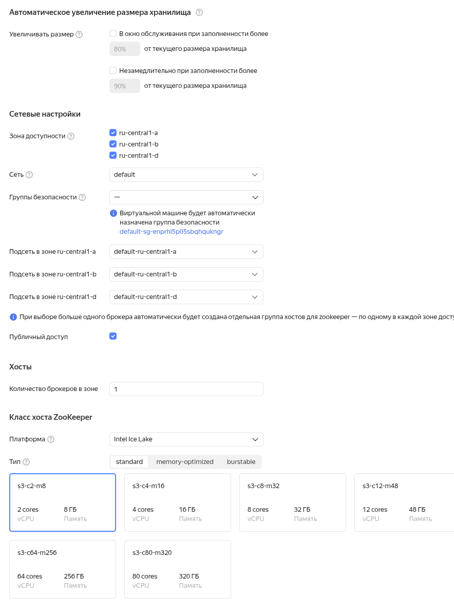
___
### 1.2) Параметры с которыми был создан топик `messages`:
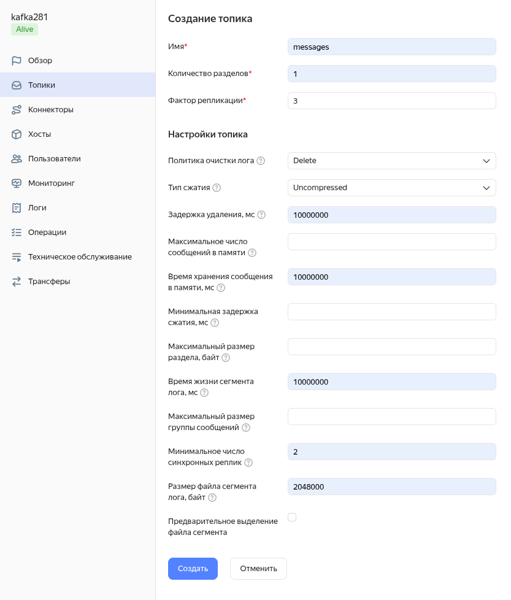
___
### 1.3) Параметры с которыми был создан пользователь `producer`:
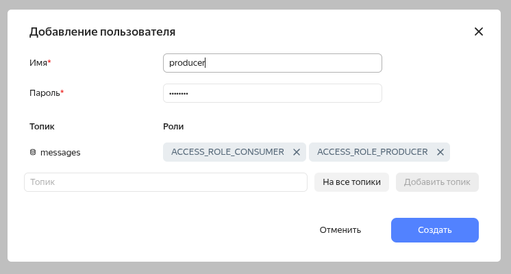
___
### 1.4) Параметры с которыми был создан пользователь `consumer`:
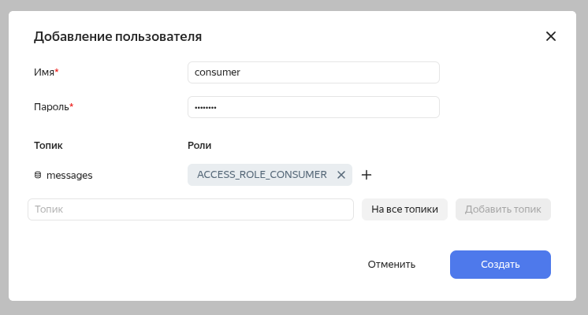
___
### 1.5) Список пользователей:
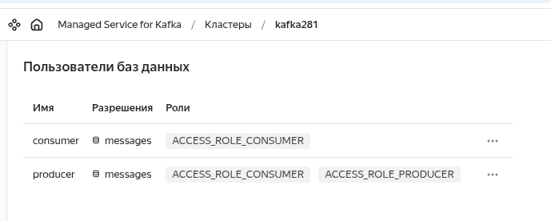
___
### 1.6) Список хостов кластера:
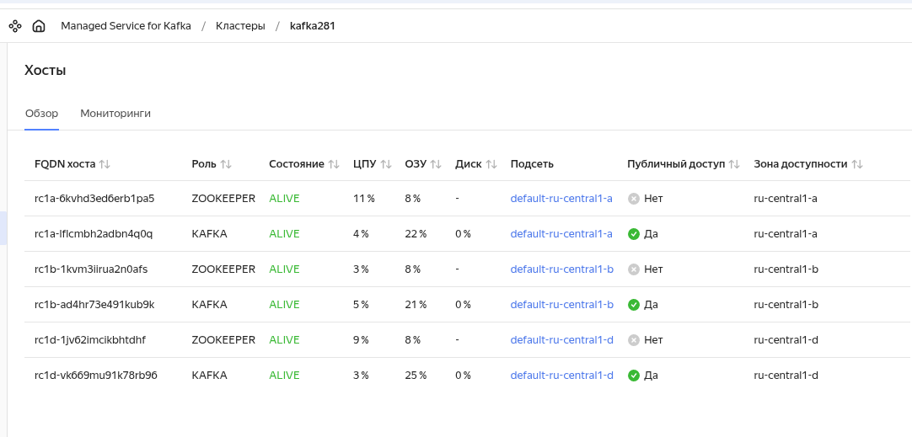
___
### 2) Создание схем данных.
### 2.1) Создание схемы данных ключаей.
#### Необходимо выполнить команду в дирректории `schemes`:
```
jq \
    -n --slurpfile data schema-key.json \
    '{
       "schemaType": "AVRO",
       "schema": "\($data)"
    }' \
| curl \
      --request POST \
      --url 'https://rc1a-lflcmbh2adbn4q0q.mdb.yandexcloud.net:443/subjects/messages-key/versions' \
      --user producer:password \
      --header 'Content-Type: application/vnd.schemaregistry.v1+json' \
      --data "@-" \
      --insecure | jq
```
#### Результат выполнения команды:
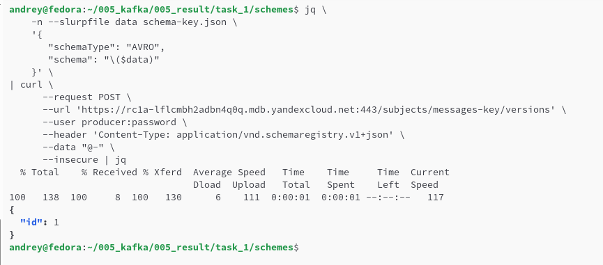
___
### 2.2) Создание схемы данных значений.
#### Необходимо выполнить команду в дирректории `schemes`:
```
jq \
    -n --slurpfile data schema-value.json \
    '{
       "schemaType": "AVRO",
       "schema": "\($data)"
    }' \
| curl \
      --request POST \
      --url 'https://rc1a-lflcmbh2adbn4q0q.mdb.yandexcloud.net:443/subjects/messages-value/versions' \
      --user producer:password \
      --header 'Content-Type: application/vnd.schemaregistry.v1+json' \
      --data "@-" \
      --insecure | jq
```
#### Результат выполнения команды:
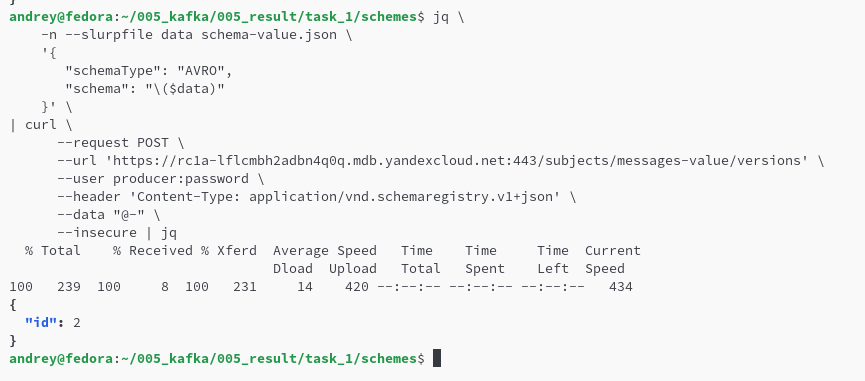
___
### 2.3) Получение идендификаторов схем данных (id схем).
#### Необходимо выполнить команду:
```
curl \
    --request GET \
    --url 'https://rc1a-lflcmbh2adbn4q0q.mdb.yandexcloud.net/schemas' \
    --user producer:password \
    --header 'Accept: application/vnd.schemaregistry.v1+json' \
    --insecure | jq
```
#### Результат выполнения команды:
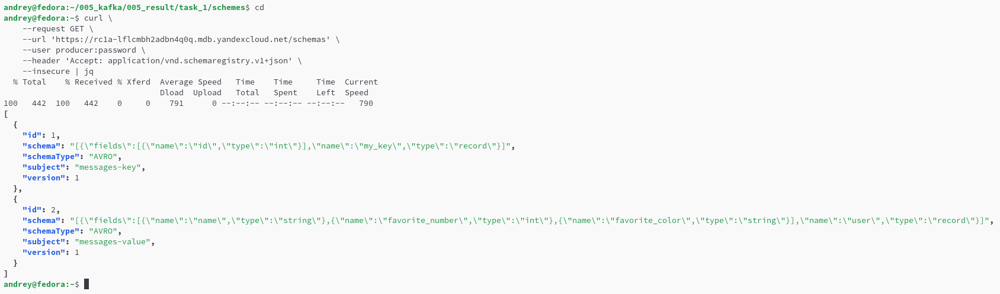
___
### 2.4) Получение списка названия схем данных.
#### Необходимо выполнить команду:
```
curl \
    --request GET \
    --url 'https://rc1a-lflcmbh2adbn4q0q.mdb.yandexcloud.net/subjects' \
    --user producer:password \
    --header 'Accept: application/vnd.schemaregistry.v1+json' \
    --insecure | jq
```
#### Результат выполнения команды:
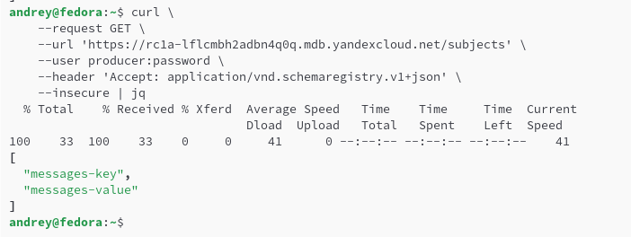
___
### 2.5) Получение номера версии схемы данных.
#### Необходимо выполнить команду:
```
curl -X GET https://rc1a-lflcmbh2adbn4q0q.mdb.yandexcloud.net:443/subjects/messages-value/versions \
    --user producer:password \
    --insecure
```
#### Результат выполнения команды:
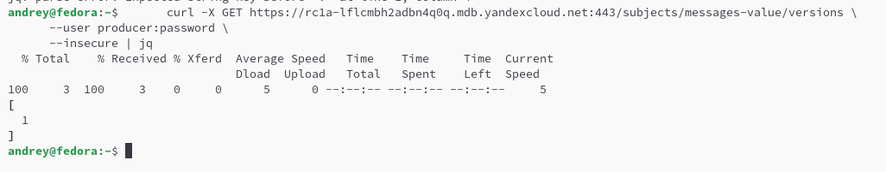
___
### 3) Отправление сообщений в топик `messages`.
### 3.1) Отправляются сообщения из файла `message-list`.
#### Необходимо выполнить команду в дирректории `schemes`, подставив соответствующие id схем данных:
```
jq \
    -n --slurpfile data message-list.json \
    '{
      "key_schema_id": 1,
      "value_schema_id": 2,
      "records": $data.[]
    }' \
| curl \
      --request POST \
      --url 'https://rc1a-lflcmbh2adbn4q0q.mdb.yandexcloud.net:443/topics/messages' \
      --user producer:password \
      --header 'Content-Type: application/vnd.kafka.avro.v2+json' \
      --header 'Accept: application/vnd.kafka.v2+json' \
      --data "@-" \
      --insecure | jq
```
#### Результат выполнения команды:
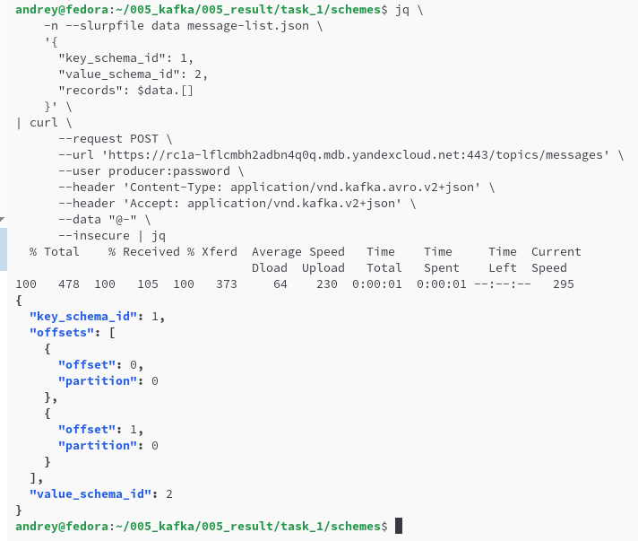
___
### 4) Получение сообщений из топика `messages`.
### 4.1) Создаем потребителя `my-consumer` в группе `my-group`.
#### Необходимо выполнить команду:
```
curl \
    --request POST \
    --url 'https://rc1a-lflcmbh2adbn4q0q.mdb.yandexcloud.net:443/consumers/my-group' \
    --user producer:password \
    --header 'Content-Type: application/vnd.kafka.v2+json' \
    --header 'Accept: application/vnd.kafka.v2+json' \
    --data '{
              "name": "my-consumer",
              "format": "avro",
              "auto.offset.reset": "earliest"
            }' \
    --insecure | jq
```
#### Результат выполнения команды:
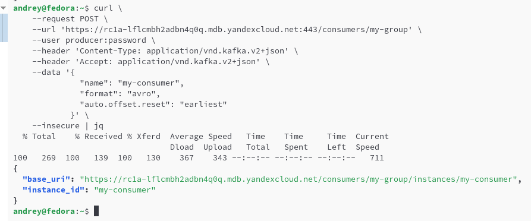
___
### 4.2) Подписываемся на топик `messages`.
#### Необходимо выполнить команду:
```
curl \
    --request POST \
    --url 'https://rc1a-lflcmbh2adbn4q0q.mdb.yandexcloud.net:443/consumers/my-group/instances/my-consumer/subscription' \
    --user producer:password \
    --header 'Content-Type: application/vnd.kafka.v2+json' \
    --header 'Accept: application/vnd.kafka.v2+json' \
    --data '{"topics": ["messages"]}' \
    --insecure | jq
```
#### Результат выполнения команды:
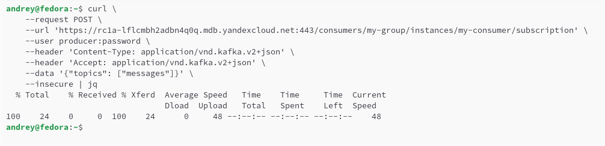
___
### 4.3) Получение сообщений из топика `messages`.
#### Необходимо выполнить команду:
```
curl \
    --request GET \
    --url 'https://rc1a-lflcmbh2adbn4q0q.mdb.yandexcloud.net:443/consumers/my-group/instances/my-consumer/records' \
    --user producer:password \
    --header 'Accept: application/vnd.kafka.avro.v2+json' \
    --insecure | jq
```
#### Результат выполнения команды:
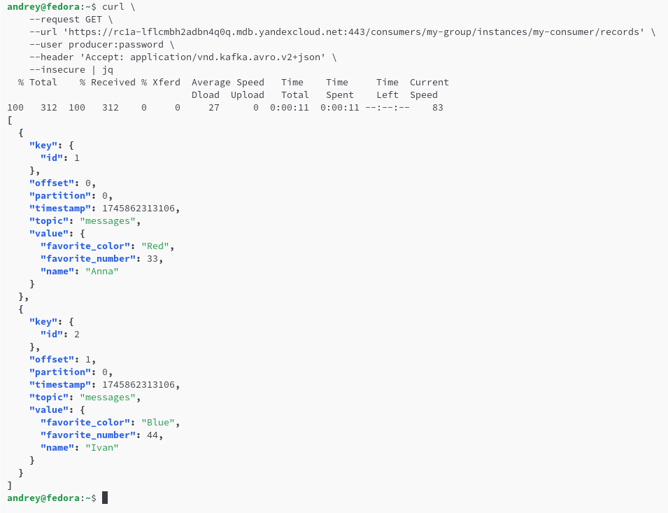
___
