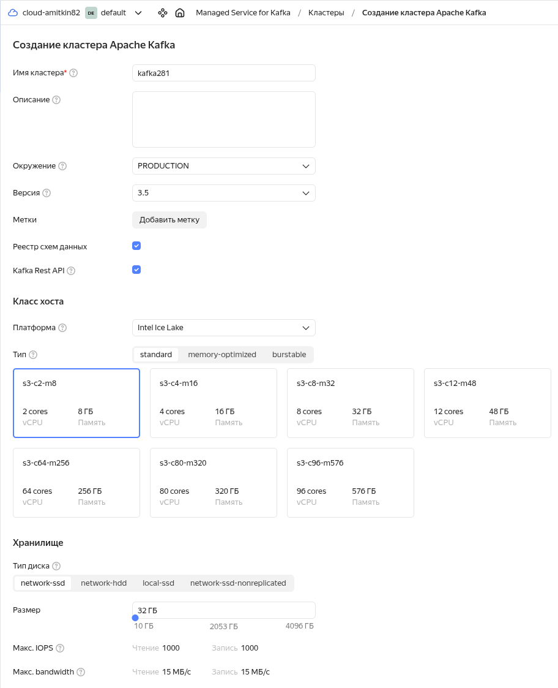

# Kafka Самостоятельная работа №5
## Задание 1. Развертывание и настройка Kafka-кластера в Yandex Cloud

### 1) Создание и развертывание кластера Kafka.
### 1.1) Параметры с которыми был создан кластер Kafka:

___

___
### 1.2) Параметры с которыми был создан топик `messages`:

___
### 1.3) Параметры с которыми был создан пользователь `producer`:

___
### 1.4) Параметры с которыми был создан пользователь `consumer`:

___
### 1.5) Список пользователей:

___
### 2) Создание схем данных.
### 2.1) Создание схемы данных ключаей.
### Необходимо выполнить команду в дирректории `schemes`:
```
jq \
    -n --slurpfile data schema-key.json \
    '{
       "schemaType": "AVRO",
       "schema": "\($data)"
    }' \
| curl \
      --request POST \
      --url 'https://rc1a-lflcmbh2adbn4q0q.mdb.yandexcloud.net:443/subjects/messages-key/versions' \
      --user producer:password \
      --header 'Content-Type: application/vnd.schemaregistry.v1+json' \
      --data "@-" \
      --insecure | jq
```
