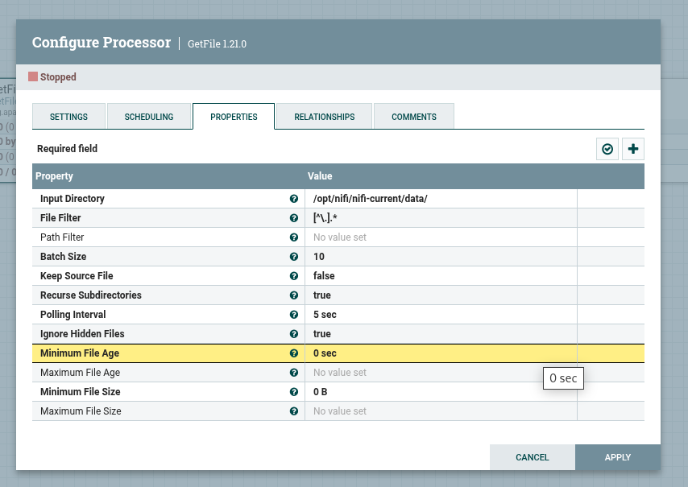

# Kafka Самостоятельная работа №5
## Задание 2. Интеграция Kafka с внешними системами (Apache NiFi/Hadoop)

### 1) Создание и развертывание кластера Kafka в облаке.
### 1.1) Используется кластер созданный для задания 1
### 1.2) В кластер добавлен топик `nifi-topic`

___
### 2) Запуск и настройка NiFi.
### 2.1) Для локального запуска NiFi в дирректории `infra` выполнить команду:
```
docker compose up -d
```
### 2.2) С помощью NiFi UI был создан и настроен Processor `GetFile`:

___

___
