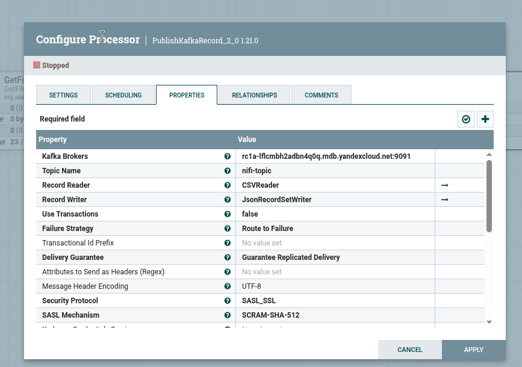
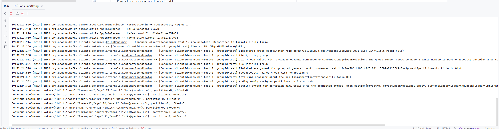
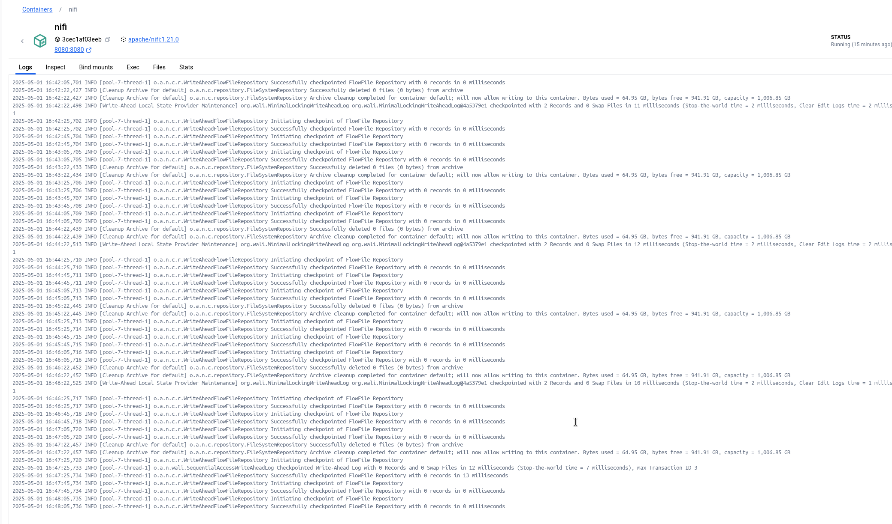

# Kafka Самостоятельная работа №5
## Задание 2. Интеграция Kafka с внешними системами (Apache NiFi/Hadoop)

### 1) Создание и развертывание кластера Kafka в облаке.
### 1.1) Используется кластер созданный для `задания 1`
### 1.2) В кластер добавлен топик `nifi-topic`

___
### 2) Запуск и настройка NiFi.
### 2.1) Для локального запуска NiFi в директории `infra` выполнить команду:
```
docker compose up -d
```
### 2.2) С помощью NiFi UI был создан и настроен Processor `GetFile`:

___

___
### 2.3) Был создан и настроен Processor `PublishKafkaRecord_2_0`:

___

___
### 2.3) В Processor `PublishKafkaRecord_2_0` был добавлен и настроен `StandardSSLContextService 1.21.0`:

___

___
### 3) Проверка работы и интеграция  NiFi с кластером Kafka в облаке:
### 3.1) Был прочитан и передан в топик `nifi-topic` файл : [input.csv](infra/nifi_data/input.csv)
### 3.2) Консьюмером были получены сообщения из топика `nifi-topic`:

___
### 3.3) Логи работы NiFi:

___
